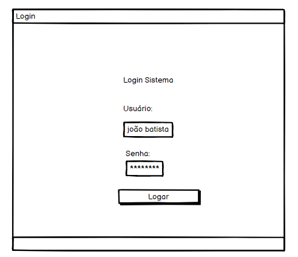
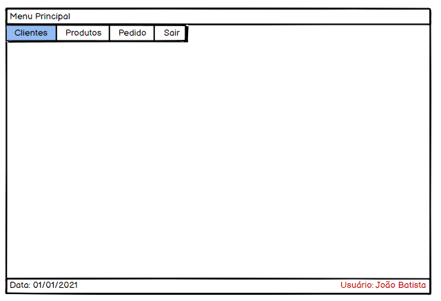
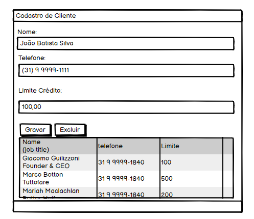
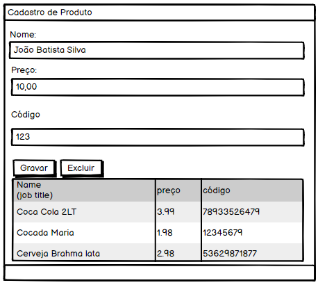
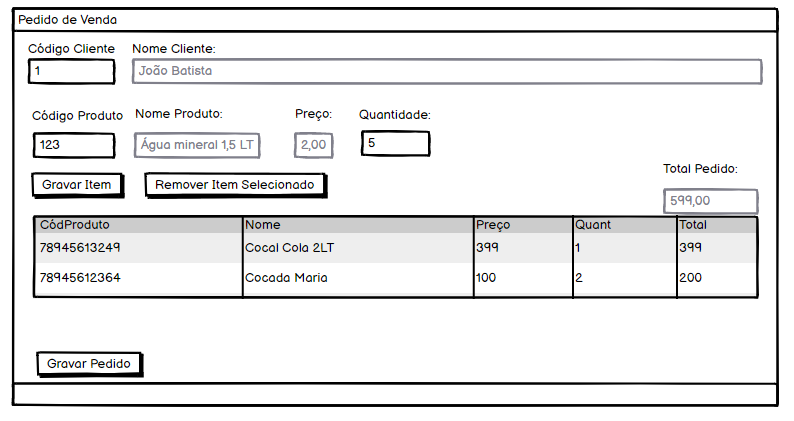

<h3 align="center">
  Teste 01
</h3>

<blockquote align="center">“Não espere para plantar, apenas tenha paciência para colher”!</blockquote>

  

  

  

  <a href="#rocket-sobre-o-desafio">Sobre o desafio</a>&nbsp;&nbsp;&nbsp;|&nbsp;&nbsp;&nbsp;
  <a href="#calendar-entrega">Entrega</a>&nbsp;&nbsp;&nbsp;|&nbsp;&nbsp;&nbsp;
  <a href="#memo-licença">Licença</a>

## :rocket: Sobre o desafio

Nesse teste, você deve criar uma aplicação para atestar aquilo que foi discutido nas entrevistas!

Utilize a linguagem de programação que julgue ter mais domínio, para produção do resultado final.

As linguagens que serão melhores avaliadas pela Linear serão: 
 - </img>
 - </img>
 - </img>
 - </img>
 - </img>

O banco de dados a ser utilizado, precisa ser o </img>. Você pode baixa-lo no link abaixo.
(https://dev.mysql.com/downloads/windows/installer/5.7.html)

Para avaliar as habilidades do(a) candidato(a) à vaga de Analista Desenvolvedor, será necessário que o mesmo implemente um projeto com um CRUD de pedidos de venda.

O projeto deve compreender uma interface gráfica para um simples sistema de pedidos de venda contendo:
 - LOGIN

  

 - MENU PRINCIPAL
 
 

  

 - CADASTRO DE CLIENTE

  

 - CADASTRO DE PRODUTO

  

 - CADASTRO DE PEDIDO DE VENDA.

  

### Regras de Negócio

Leia com atenção 🤓, todas as regras a serem implementadas. Tente ter uma visão objetiva do desenvolvimento da aplicação, começando sempre pelas entidades que não possuem dependência composta. (A tela de Pedido de Venda depende de clientes e produtos, portanto, deve ser a ultima a ser implementada. 😉)

Para logar na aplicação, adicione manualmente o usuário no banco de dados, utilizando alguma ferramenta de gerenciamento de scripts de banco de dados. No link abaixo sugerimos uma bem legal 😍
(https://www.heidisql.com/download.php)

## Login

 - RN1: Não deve permitir logar ususário que não estejam cadastrados no banco de dados.
  
## Menu Principal

 - RN: N/A.

## Cadastro de Clientes

 - RN1: Não permitir excluir usuário que estejam referenciados em uma venda.

 - RN2: Não permitir gravar usuário sem o valor de limite de crédito, ou limite 0.

## Cadastro de Produtos

 - RN1: Não permitir gravar produtos sem o código,ou com código zerado.

 - RN2: Não permitir gravar produtos sem o preço, ou com preço zerado.
  
## Cadastro de Pedido de Venda

 - RN1: Não permitir gravar pedido para clientes cujo o valor do limite, ultrapasse o do cadastro de cliente.

 - RN2: Ao gravar um pedido, abater o valor total do pedido, no limite de crédito do cliente utilizado.

 - RN3: Não permitir inserção de produtos com preço de venda zerados.

Se dividirmos semânticamente as responsabilidades da nossa aplicação em entidades, considere separar as regras de negócio, da camada de visão.

### Requisitos desejáveis, não obrigatórios, mas que serão levado em consideração para critério de desempate  👏👏
 - Produza pelo menos dois diagramas UML da sua preferência sobre qualquer parte da aplicação. (Caso esteja perdido em qual 😂, sugerimos do de Caso de Uso e Diagrama de Sequência)
 - Modelo de entidade-relacionamento do banco de dados.

Bons estudos <3

## :calendar: Entrega

Esse desafio deve ser entregue por email (respondendo o e-mail enviado pela linear), na qual ele deve contar o link do seu repositório do Git Hub, com o projeto.

Não se esqueça de montar um arquivo README.MD incrível, nos explicando as tecnologias usadas, dependências do projeto e como subir a sua aplicação (script do banco sql por exemplo). 😉

Caso precise de uma ajuda em como montar um README.MD nos moldes convencionais, dê uma olhada neste perfil.
(https://github.com/thiagokrathos/go-restaurant-mobile)

## :memo: Licença

Esse projeto está sob a licença MIT. Veja o arquivo [LICENSE](../LICENSE) para mais detalhes.

---

Feito com 💜 by Rocketseat :wave: [Entre na nossa comunidade!](https://discordapp.com/invite/gCRAFhc)
